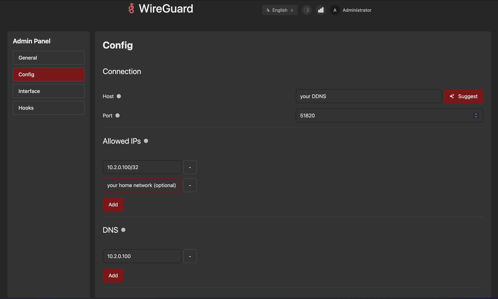

## What is this?

**WireHole (UI-ODoH)** is a fork of [WireHole](https://github.com/IAmStoxe/WireHole) and [WireHole-UI](https://github.com/10h30/wirehole-ui), modified to replace Unbound with [DNSCrypt-Proxy](https://github.com/DNSCrypt/dnscrypt-proxy) for encrypted DNS over HTTPS with **anonymized, oblivious DoH (ODoH)** support.

This all-in-one Docker Compose project enables users to easily deploy a self-managed, full or split-tunnel **WireGuard VPN** with:

- Ad-blocking via **Pi-hole**
- A web-based client manager via **WG-Easy** updated to v15
- **Encrypted, anonymized ODoH DNS** with DNSSEC and relay support using **DNSCrypt-Proxy**. Read more [here](https://github.com/SwaroopGiri/Pihole-with-Anonymized-ODOH/)

---

## Features

* All-in-one: WireGuard + Web UI + Adblock (via Pi-hole) + DNSCrypt-Proxy (ODoH)
* Easy installation, simple to use.
* List, create, edit, delete, enable & disable WireGuard clients.
* Show a client's QR code.
* Download a client's configuration file.
* Statistics for connected clients.
* Gravatar support.
* Secure and private DNS with anonymized ODoH and DNSSEC.

---

## Credits

This fork builds on the work of:

- **[@IAmStoxe](https://github.com/IAmStoxe)** – Creator of the original [WireHole](https://github.com/IAmStoxe/WireHole)  
  ☕ [Buy Me a Coffee](https://www.buymeacoffee.com/IAmStoxe)

- **[@10h30](https://github.com/10h30)** – Developer of the wirehole-ui interface
  🔗 [Wirehole-UI](https://github.com/10h30/wirehole-ui) 

- **[@SwaroopGiri](https://github.com/SwaroopGiri)** – Inspiration for ODoH + Pi-hole integration from  
  🔗 [Pihole-with-Anonymized-ODOH](https://github.com/SwaroopGiri/Pihole-with-Anonymized-ODOH/)

---

## Author of This Fork

👤 **[@mgrimace](https://github.com/mgrimace)**

Pull requests to contribute improvements to this fork are welcome and encouraged. I'm still learning and doing this in my limited spare time, please be patient with any problems and contribute where you can.

🙏 If you'd like to support further development:

<a href="https://www.buymeacoffee.com/cammaratam" target="_blank"></a>

---

### Quickstart
To get started all you need to do is clone the repository, set the Pi-Hole webui password, and spin up the containers.

```bash
git clone https://github.com/mgrimace/wirehole-ui-odoh.git
cd wirehole-ui-odoh
nano docker-compose.yaml
docker compose up -d
```
### Full Setup

1. Install docker according to the official documentation, for example on a Raspberry Pi (debian-based): https://docs.docker.com/engine/install/debian/

2. **Clone this repository**  
   ```bash
   git clone https://github.com/mgrimace/wirehole-ui-odoh.git
   cd wirehole-ui-odoh
    ```
3. **Set Pi-hole web interface password**  
    - Set a password directly in the `docker-compose.yaml`, or create a `.env` file next to `docker-compose.yml`:
     ```ini
     PIHOLE_WEB_PASSWORD=your-secure-password
     ```
4. **Review `docker-compose.yml` settings**  
    - **dnscrypt-proxy**  
      - Handles encrypted and anonymized DNS.
      - Uses a custom `dnscrypt-proxy.toml` from `./dnscrypt-proxy`.
      - Runs at `10.2.0.200:5350` on the `wirehole` network.

    - **Pi-hole**  
      - Acts as the DNS sinkhole and ad blocker.
      - Uses dnscrypt-proxy as its only upstream (`10.2.0.200#5350`).
      - Runs at `10.2.0.100` with environment variables for timezone, web UI password, and DNS config.

    - **wg-easy**  
      - Provides a simple web UI for managing WireGuard.
      - Uses Pi-hole for DNS (`10.2.0.100`) and routes through the subnet `10.2.0.0/24`.
      - Set `INSECURE: true` by default for easier setup (can be changed later).

    - **watchtower** *(optional)*  
      - Automatically updates running containers. You can remove or disable it if preferred.

    > If you want to use a different IP range or subnet, update the `networks:` section and any related environment variables accordingly.

5. **Launch the stack**  
   ```bash
   docker-compose up -d
   ```

    - **Troubleshooting Permissions**:  
      - Double check that DNScrypt proxy can read the provided .toml at `/dnscrypt-proxy/dnscrypt-proxy.toml` using `docker logs dnscrypt-proxy` and loook for any errors. If so, you may need to change its folder permissions, then restart the container e.g., 

      ```bash
      sudo chmod -R 644 dnscrypt-proxy
      ```

6. **Setup WG-Easy and split-tunnel**
    - Navigate to the Web UI will atn http://0.0.0.0:51821 or http://<device or server IP>:51821. 
    - Setup your admin account, and navigate to administrator>admin panel>config (see screeshot below)
    - Set 'HOST' to your Dynamic DNS (DDNS) address or your server's public address
    - Set DNS as `10.2.0.11`
    - **Recommended configuration / Split tunnel**  
      - Set Allowed IPs to `10.2.0.0/24` so only DNS/UI traffic goes via VPN; other traffic remains on client’s normal route.
      - Optionally, add an Allowed IP for your home network to access your self-hosted services on-the-go (e.g., `192.168.1.0/24`)

    > Note: wg-easy v15 does not use environmental variables for the config the same as previous versions; however, all default values are still provided in the docker-compose.yaml for setup reference. Do not comment those values back into your compose or you'll receive an error, they are for reference only.

<p align="center">
  
</p>

7. **Setup your router**
    - Go to your router settings, note these steps depend entirely on your own router model
    - Forward port 51820 to your Wirehole's local IP address to enable Wireguard to work properly
    - Set your primary DNS in your DHCP server settings to your Wirehole's local IP. 
    > Important: Leave the secondary DNS blank, it is not a backup or fallback, it is a load balancer and *will* leak DNS/ads if enabled.

8. **Test for DNS leaks** 

    - Go to https://www.dnsleaktest.com/ and run a standard test. You may see more than one DNS server listed and as long as your ISP isn't listed, you were successful!

---

## Access PiHole

Navigate to your Wirehole's local IP https://<wirehole ip>/admin, or, while connected to WireGuard, navigate to http://10.2.0.100/admin 


PiHole is already preset with DNSCrypt-Proxy as its custom upstream DNS provider. 

### (Optional) Setting a DNS record for pihole
> Note: if you're using a Raspberry Pi, this is already likely set as `raspberrypi.local`. Otherwise:
1. Login to pihole admin
2. Navigate to "Local Records"
3. Fill out the form like the image below


Provided your DNS is properly configured on the device you're using, and you're connected to WireGuard, you can now navigate to http://pi.hole/admin and it should take you right to the pihole admin interface.


---

## Customizing DNSCrypt-Proxy

The `dnscrypt-proxy` service uses `./dnscrypt-proxy/dnscrypt-proxy.toml`. It is pre-set for ODoH out-of-the-box; however, to change ODoH servers, relays, filters, options, etc.:

```bash
# Edit the file in your editor, then:
docker-compose restart dnscrypt-proxy
docker-compose logs -f dnscrypt-proxy
```

---

## Updating Info

Below are the instructions for updating **containers**:

### Via Docker Compose

* Update all images: `docker-compose pull`
  * or update a single image: `docker-compose pull wireguard`
* Let compose update all containers as necessary: `docker-compose up -d`
  * or update a single container: `docker-compose up -d wireguard`
* You can also remove the old dangling images: `docker image prune`

### Via Watchtower auto-updater 

* The compose file is already set with Watchtower for auto-updates. If you prefer, disable this. 

> **Note:** Watchtower is not endorsed as a solution for automated updates of existing Docker containers. In fact generally automated updates are discouraged. However, this is a useful tool for largely unattended systems. In this fork, both PiHole and DNSCrypt-Proxy use the `latest` tags which *may* cause breaking changes on updates, but generally do not; whereas WG-easy is preset to version `15` becasuse new versions *often* include breaking changes. LinuxServer.io highly recommends using Docker Compose.

---


## FAQ

### Why DNSCrypt-Proxy (ODoH) instead of Unbound?
DNSCrypt is an alternative to Unbound, and both cannot be used at the same time.

- Use **Unbound** for self-contained, local, recursive DNS resolution.
- Use **DNSCrypt** for encrypted, anonymized DNS with enhanced privacy.

Key features of **DNSCrypt**:
- **Encrypted DNS** – Queries are encrypted to upstream resolvers.
- **Anonymized ODoH** – Hides your IP from the resolver.
- **DNSSEC** – Validation handled by dnscrypt-proxy.

Anonymized DNS is a lightweight privacy layer for DNS, similar in spirit to Tor or SOCKS—but purpose-built. It hides client IPs from DNS resolvers, ensuring confidentiality and integrity.  
> Note: DNS anonymization only works with servers that support the DNSCrypt protocol. The .toml in this repo is preset for ODoH and DNSCrypt protocol.

### Does this work on a Raspberry Pi?
I use this on a Raspberry Pi Zero 2w with Raspberry Pi OS Lite (64bit; Debian 12 Bookworm)

### Can I build ARM variants on x86_64?

The ARM variants can be built on x86_64 hardware using `multiarch/qemu-user-static`

```bash
docker run --rm --privileged multiarch/qemu-user-static:register --reset
```

Once registered you can define the dockerfile to use with `-f Dockerfile.aarch64`.

### Where can I get additional block lists?
* [The Big Blocklist Collection](https://firebog.net/)

### Commonly whitelisted domains
* [Pi-Hole Community List](https://discourse.pi-hole.net/t/commonly-whitelisted-domains/212)
* [anudeepND Whitelist](https://github.com/anudeepND/whitelist)

---

## Networking Considerations

If you plan to use Wireguard both remotely and locally, say on your mobile phone, edit the config use on-demand activation with an exception for your home network.

---

###### Shout out to LinuxServer.io for their documentation and maintenance of the incredible Wireguard image.

--- 
